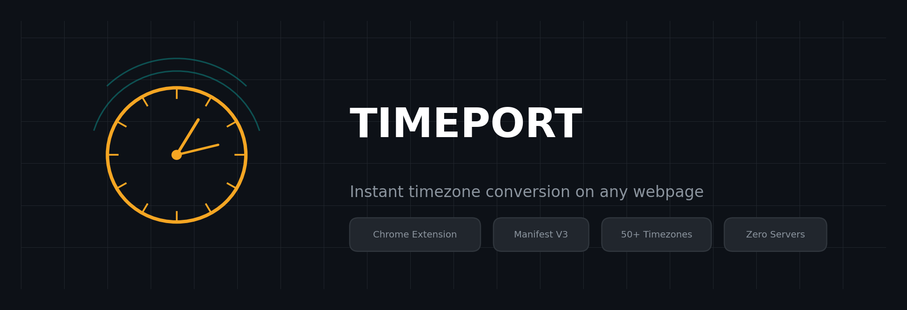
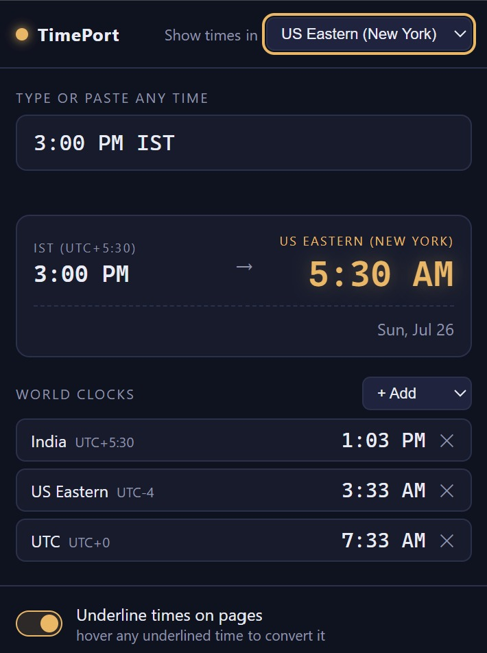

<p align="center">
  
</p>

<p align="center">
  <strong>See any time on any webpage — instantly converted to your timezone.</strong><br>
  Works on LinkedIn, Gmail, WhatsApp Web, Slack, Twitter/X, and everywhere else.
</p>

<p align="center">
  
  
  
  
</p>

---

## How it works

<p align="center">
  
</p>

| Feature | What happens |
|---------|-------------|
| **Hover** | Times with a timezone on any page get a dashed amber underline. Hover → tooltip shows the time in your zone. |
| **Select** | Highlight any text containing a time → a bubble appears with the conversion. Works even where auto-detection misses. |
| **Popup** | Click the icon → type `9:30pm PST`, `noon CET`, `13:00 UTC+2` → live conversion + world clocks. |

---

## Install

> Chrome, Edge, and Brave — any Chromium browser.

1. **Clone or download** this repo
2. Open `chrome://extensions` in your browser
3. Turn on **Developer mode** (toggle, top-right)
4. Click **Load unpacked** → select this folder (the one with `manifest.json`)
5. Pin TimePort from the 🧩 icon so it's always one click away
6. **Refresh** any tabs that were already open

---

## What it understands

**Time formats**
- 12h and 24h: `3pm`, `3:45 PM`, `14:00`, `noon`, `midnight`

**~50 timezone abbreviations**
- US: `EST/EDT`, `CST/CDT`, `MST/MDT`, `PST/PDT`, `ET/CT/MT/PT`
- Europe: `GMT`, `BST`, `CET/CEST`, `EET/EEST`, `MSK`
- Asia: `IST`, `PKT`, `SGT`, `HKT`, `JST`, `KST`
- Oceania: `AEST/AEDT`, `ACST`, `AWST`, `NZST/NZDT`
- Explicit offsets: `UTC+5:30`, `GMT-8`, `UTC +2`

**Smart defaults:** `ET/CT/MT/PT` auto-resolve to standard or daylight based on whether US DST is active. `IST` defaults to India (UTC+5:30). `CST` defaults to US Central.

---

## Known limits

- **Dates aren't parsed** — conversions assume today, and show "next day / previous day" when crossing midnight
- **Input boxes are skipped** — no interference with your typing; select the text instead to get the bubble
- Ambiguous abbreviations (`IST` = India, not Ireland or Israel; `CST` = US Central, not China) pick the most common reading

---

## Privacy

Everything runs locally. No servers, no analytics, no data leaves your machine. The only stored data is your settings (target zone, pinned clocks, toggle), synced via Chrome's built-in storage.

---

## Tech

- **Manifest V3** — current Chrome extension standard
- **Zero dependencies** — no npm, no build step, no frameworks
- **~50 timezone abbreviations** parsed via a custom regex + offset map in [`tz.js`](tz.js)
- Content script injects only on user-visible pages; popup is a standalone UI

---

## Project structure

```
├── manifest.json     # Extension config (Manifest V3)
├── tz.js             # Timezone parsing engine — shared by popup + content script
├── content.js        # Page scanner: auto-underline + selection bubble
├── content.css       # Tooltip & bubble styles
├── popup.html        # Popup UI
├── popup.js          # Popup logic: converter, world clocks, settings
├── popup.css         # Popup styles
├── icons/            # Extension icons (16, 48, 128px)
└── assets/           # README images
```

---

## License

MIT

---

<p align="center">
  <sub>Built as a personal tool for managing meetings across IST, EST, and PST — turned out useful enough to share.</sub>
</p>
